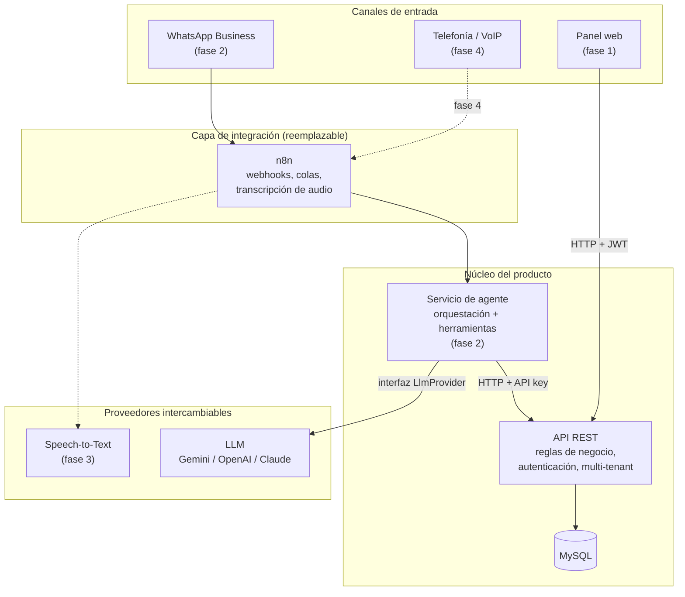
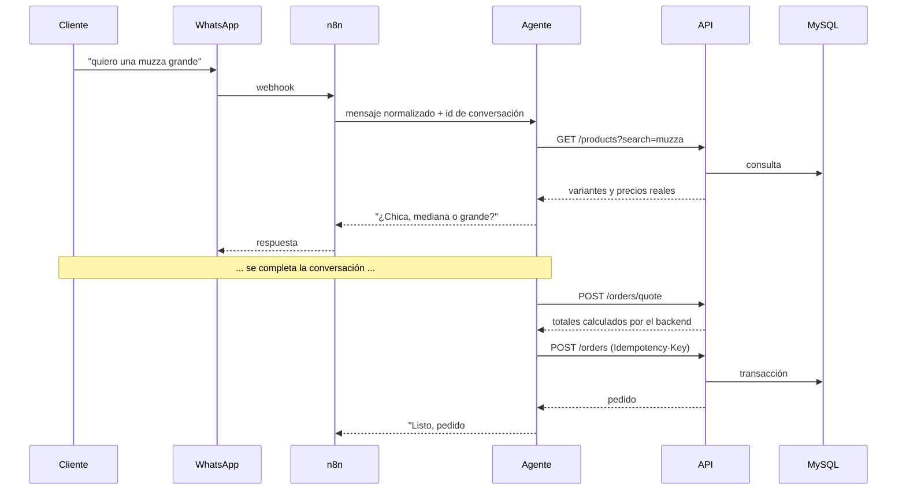

# 02 — Arquitectura propuesta

## 1. Regla que ordena todo lo demás

> Toda regla de negocio vive en la API. n8n mueve mensajes. El modelo de IA decide qué herramienta
> llamar. Ninguno de los dos calcula un precio, valida una transición de estado ni escribe en la base
> de datos.

Prueba concreta para saber si se está cumpliendo: **si mañana se reemplaza n8n por un webhook propio
y Gemini por Claude, no debería cambiar ninguna tabla ni ningún endpoint del backend.** Si un cambio
propuesto rompe esa prueba, está mal ubicado.

## 2. Vista de componentes



Lo importante del diagrama: **todas las flechas hacia la base de datos pasan por la API**. n8n y el
LLM nunca tocan MySQL.

## 3. Responsabilidades y límites

### 3.1 API REST — el núcleo

Es dueña de: autenticación y autorización, aislamiento entre comercios, catálogo, clientes, ciclo de
vida de los pedidos, cálculo de totales y envíos, historial y métricas.

Es el único componente con credenciales de base de datos. Expone un contrato versionado (`/api/v1`)
documentado en OpenAPI, que consumen indistintamente el panel web, n8n, el agente y cualquier cliente
futuro. No hay endpoints "para n8n": hay endpoints, y n8n es un cliente más.

### 3.2 Panel web

Cliente de la API sin lógica de negocio propia. Puede calcular cosas para mostrar (formato de moneda,
orden de una lista), pero nunca el total de un pedido: eso lo pide a `/orders/quote`, para que el
número que ve el operador sea exactamente el que va a guardar el backend.

### 3.3 n8n — capa de integración

Lo que sí hace: recibir el webhook de WhatsApp, normalizar el payload, invocar transcripción de
audio, llamar al servicio de agente, devolver la respuesta a WhatsApp, reintentar ante errores
transitorios y notificar fallas.

Lo que no hace nunca: consultar precios, decidir si un producto está disponible, armar el pedido,
calcular envíos, escribir en la base. Si un flujo de n8n empieza a tener nodos "Function" con
condiciones de negocio, eso es una señal de que falta un endpoint en la API.

Si la organización decide más adelante que n8n no le sirve, se reemplaza por un controlador de
webhooks en el propio backend sin tocar nada más.

### 3.4 Servicio de agente — **implementado**

> Construido en `apps/api/src/modules/agent/`. El detalle completo —herramientas, límites, cómo
> conectar un número real— está en [08 — Asistente de WhatsApp](08-asistente-whatsapp.md).

Traduce entre lenguaje natural y llamadas a la API. Responsabilidades: mantener el estado de la
conversación, decidir qué herramienta invocar, ejecutarla contra la API y redactar la respuesta.

Lo que se construyó respeta las dos definiciones de abajo, con tres agregados que la práctica
mostró necesarios:

- **Un proveedor por reglas (`scripted`) como opción por defecto.** No necesita credenciales ni red.
  Sirve para tres cosas distintas: mostrar el producto sin contratar nada, probar el runtime de
  forma determinista, y responder cuando el proveedor de IA se cae. La fábrica envuelve al proveedor
  remoto con este como respaldo automático.
- **El pedido a medio armar viaja aparte del historial.** Vive en la conversación (columna `draft`)
  y se le pasa al modelo como estado estructurado. El historial que ve el modelo es sólo lo que vio
  el cliente: los resultados de herramientas viejos son datos vencidos y volver a mostrárselos lo
  llevaría a repetirlos como si valieran.
- **El reconocimiento de lo que pide el cliente ("una muza grande") es código nuestro**, no del
  modelo. Así el precio y la disponibilidad siempre salen de la base, y el mismo reconocimiento
  funciona con cualquier proveedor o sin ninguno.

Dos definiciones que evitan el acoplamiento:

```ts
// El proveedor de IA se abstrae detrás de una interfaz mínima.
interface LlmProvider {
  name: string;
  complete(input: {
    system: string;
    messages: ConversationMessage[];
    tools: ToolDefinition[];
  }): Promise<LlmResponse>; // texto y/o llamadas a herramientas
}
```

- Las implementaciones (`ScriptedLlmProvider`, `AnthropicLlmProvider`, `OpenAiLlmProvider`) se eligen
  por configuración (`LLM_PROVIDER`). El resto del sistema solo conoce la interfaz. `LLM_BASE_URL`
  alcanza para apuntar el proveedor "openai" a cualquier servicio compatible, incluido un modelo
  corriendo en una máquina propia.
- Las herramientas se definen **una sola vez** como envoltorios tipados sobre endpoints de la API, y
  cada proveedor las traduce a su formato. No se reescriben por proveedor.
- **El estado de la conversación se persiste en nuestra base de datos**, no en n8n ni en el proveedor
  del modelo. Esta es la decisión que realmente determina si estamos acoplados: si el historial de
  chat vive en n8n, cambiar de herramienta implica perder el contexto de todos los clientes.

Dónde vive este servicio: puede empezar como un módulo del mismo backend (`modules/agent`) y
extraerse a un proceso separado cuando el volumen lo justifique. Lo que importa es que se comunique
con el dominio a través de la misma API pública que usa cualquier cliente externo, para que la
extracción sea posible sin reescribir nada.

### 3.5 Base de datos

MySQL, accedida exclusivamente por la API a través de Prisma. Todas las migraciones versionadas en el
repositorio. Sin acceso directo desde ningún otro componente, ni siquiera para lectura.

## 4. Cómo entra un pedido, por cada canal



El pedido creado por el agente aparece en el panel exactamente igual que uno cargado a mano, con la
única diferencia del campo `source`. El personal no tiene que aprender dos flujos, y el dashboard
mide ambos canales con la misma consulta.

## 5. Seguridad

| Aspecto | Decisión |
|---|---|
| Personas | Access token JWT corto (15 min) + refresh token rotativo en cookie `httpOnly` |
| Máquinas (n8n, agente) | API key por comercio, guardada hasheada, con scopes y revocable |
| Autorización | Roles por comercio: `OWNER`, `MANAGER`, `STAFF`; `PLATFORM_ADMIN` global |
| Aislamiento | Comercio derivado siempre del token, nunca de un parámetro del cliente |
| Validación | Zod en el borde; ningún handler recibe datos sin validar |
| Contraseñas | Argon2id |
| Rate limiting | Por IP en login, por API key en los endpoints que usa el agente |
| Secretos | Solo por variables de entorno, validadas al arrancar; nada de secretos en el repositorio |
| Logs | Estructurados con `requestId`, sin datos sensibles (teléfonos truncados, nunca tokens) |

Sobre el webhook de WhatsApp: la verificación de firma de Meta y el token de la aplicación viven en
n8n o en el módulo de integraciones, nunca expuestos al modelo de IA.

## 6. Entornos y despliegue

Tres entornos: local (Docker Compose con MySQL), staging y producción. El backend es stateless, así
que escala horizontalmente; el único estado vive en MySQL. Las migraciones de Prisma se ejecutan como
paso explícito del despliegue, no al arrancar el proceso.

Para el piloto alcanza con un contenedor de API, uno de frontend estático y una instancia de MySQL
gestionada. n8n se despliega aparte, y el hecho de que pueda caerse sin afectar al panel web es una
propiedad deseable de esta arquitectura, no un accidente.

## 7. Lo que esta arquitectura deja preparado sin construir

- **Telefonía (fase 4):** un canal más que termina llamando al servicio de agente. El campo `source`
  del pedido ya lo contempla; no hay que tocar el dominio.
- **App móvil o web pública de pedidos:** clientes adicionales de la misma API. Para la web pública
  haría falta un modo de autenticación de cliente final, que hoy no existe y no hace falta.
- **Multi-comercio real:** el aislamiento ya está; faltaría onboarding, facturación de la plataforma
  y administración global.
- **Tiempo real:** el contrato de listados con cursor y `updatedAt` permite pasar de polling a SSE
  cambiando el transporte, sin cambiar los datos.
