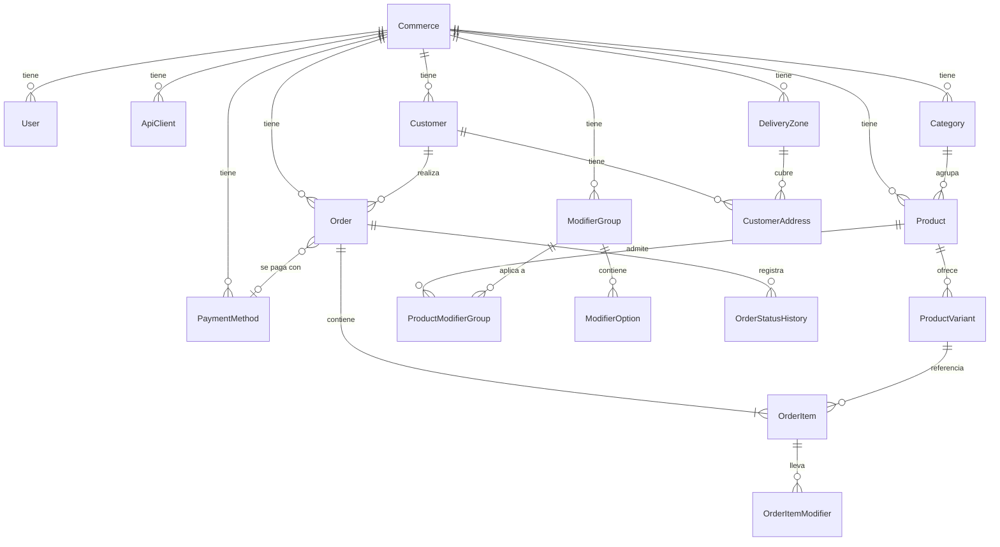
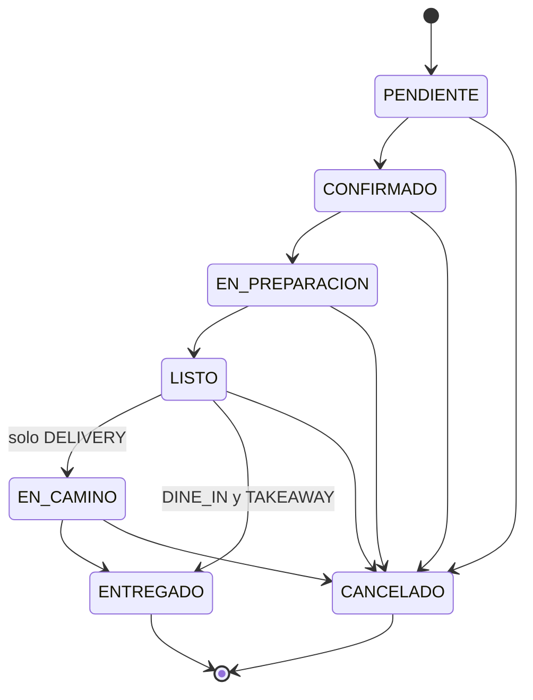

# 03 — Modelo de datos propuesto

Modelo para la fase 1 (MVP), diseñado para que las fases 2–4 sumen tablas sin migrar las existentes.

## 1. Reglas transversales

1. **Todas las tablas de negocio llevan `commerceId`**, y forma parte del índice compuesto principal.
   Se filtra en la capa de acceso a datos, nunca a criterio de quien escribe la consulta.
2. **El dinero es un entero en centavos** (`Int`), con sufijo `Cents` en el nombre. Sin excepciones.
3. **Las líneas de pedido guardan copia de nombres y precios**. Las FK al catálogo son opcionales y
   solo sirven para reportes.
4. **Nada se borra físicamente** cuando tiene historial asociado: productos y clientes se desactivan
   (`isActive` / `deletedAt`). Un pedido de 2025 tiene que poder leerse en 2027.
5. **Todo en UTC.** La zona horaria y la hora de corte del día operativo son propiedades del
   comercio y se aplican al presentar y al agregar métricas.
6. **Identificadores:** claves primarias autoincrementales internas para eficiencia de índices, más
   un `publicId` (CUID) para exponer hacia afuera, de modo que las URLs no revelen volumen de negocio
   ni permitan enumerar pedidos de otro comercio.

## 2. Diagrama de entidades



## 3. Entidades

### Commerce (tenant)

Raíz del aislamiento. Guarda datos de contacto, `timezone`, `currency`, la hora de corte del día
operativo y ajustes operativos en un `settings` JSON (horarios, tiempo estimado de preparación,
monto mínimo de envío). Los ajustes que necesiten consultarse o filtrarse se promueven a columnas;
el JSON es para lo que solo se lee completo.

### User / ApiClient

Dos identidades separadas, como se explica en el documento 01. `User` es una persona con contraseña
y rol; `ApiClient` es una credencial de máquina con `keyHash`, `scopes` y `revokedAt`. Ambos pueden
figurar como autor de un pedido o de un cambio de estado, por eso `Order` y `OrderStatusHistory`
tienen ambas referencias y ambas opcionales.

### Category / Product / ProductVariant

`Product` es el concepto comercial ("Muzzarella"); `ProductVariant` es lo que se vende y lo que tiene
precio ("Chica", "Grande"). **Todo producto tiene al menos una variante**, aunque sea "Única": así el
pedido siempre referencia una variante y no hay dos rutas de código.

La disponibilidad existe en los dos niveles: se puede cortar un producto entero ("hoy no hay
napolitana") o solo un tamaño ("se acabó la masa grande").

### ModifierGroup / ModifierOption / ProductModifierGroup

Extras y opciones ("Agregar huevo +$800", "Sin cebolla"). Los grupos se definen a nivel comercio y se
asocian a productos, para no repetir "Extras de pizza" en veinte productos. `minSelect` / `maxSelect`
permiten expresar "elegí hasta 3 extras" u "obligatorio elegir 1".

**Presente en el esquema del MVP, con ABM mínimo en la UI.** El motivo de incluirlo desde el día 1 es
que `OrderItemModifier` cambia la forma de calcular totales, y agregarlo después obliga a revisar
todo el cálculo y las métricas ya generadas.

### Customer / CustomerAddress

`phoneE164` es la identidad, con índice único por comercio. `phoneRaw` guarda lo que tipeó el
operador. Los agregados (`ordersCount`, `totalSpentCents`, `lastOrderAt`) se recalculan al confirmar
o cancelar un pedido: son denormalización deliberada para no hacer un `GROUP BY` sobre todo el
historial cada vez que se abre una ficha.

Las direcciones se guardan en campos separados (calle, número, piso/depto, barrio, referencias)
porque "dejar todo en un texto libre" impide asociar la zona de envío y complica que el agente
confirme datos por WhatsApp.

### DeliveryZone

Nombre de la zona y costo fijo. El pedido guarda el costo como foto, así que cambiar la tarifa nunca
altera pedidos pasados.

### PaymentMethod

Configurable por comercio (efectivo, transferencia, débito, crédito, Mercado Pago). El flag
`requiresChangeFor` habilita registrar "paga con $20.000" para calcular el vuelto, que es una
necesidad real del reparto — sujeto a confirmación con la pizzería.

### Order

El centro del modelo. Además de los campos del enunciado:

- `number`: correlativo **por comercio y por día operativo**, para que el personal diga "el pedido
  37". Se genera con una tabla contador y bloqueo dentro de la transacción de creación, no con
  autoincremento global (que filtraría el volumen entre comercios y daría números impracticables).
- `businessDate`: día operativo ya resuelto (`DATE`), para que el dashboard no tenga que recalcular
  la ventana horaria en cada consulta.
- `source`: `PANEL`, `WHATSAPP`, `PHONE`, `WEB`. Preparado para las fases siguientes.
- `idempotencyKey`: único por comercio, para tolerar reintentos de n8n.
- Snapshot de `customerName`, `customerPhone` y de la dirección de entrega: un pedido tiene que poder
  leerse aunque el cliente se haya editado o borrado después.
- Totales desglosados: `subtotalCents`, `deliveryFeeCents`, `discountCents`, `totalCents`. **Los
  calcula siempre el backend**; si el cliente HTTP los manda, se ignoran.

### OrderItem / OrderItemModifier

Una línea por producto pedido, con toda la información congelada: nombre, nombre de variante, precio
unitario, cantidad, notas ("sin aceitunas") y total de línea. Los modificadores replican el mismo
patrón con su `priceDeltaCents`.

### OrderStatusHistory

Una fila por transición: `fromStatus`, `toStatus`, autor y momento. Habilita auditoría desde el MVP y
las métricas de tiempos de preparación más adelante, sin cambiar el esquema.

### OrderCounter

Tabla auxiliar `(commerceId, businessDate) → lastNumber` para generar el correlativo diario bajo
bloqueo transaccional.

### Promotion

Promociones vigentes, con vigencia opcional y días de la semana en los que aplican. A propósito **no
calcula descuentos**: es el texto que el comercio escribe y el asistente transmite. Un motor de
reglas de descuento es un producto en sí mismo, y arrancar por ahí garantizaría promociones que la
pizzería no puede cargar sola. Cuando el descuento se aplique de verdad, el importe sigue saliendo de
`Order.discountCents`, que ya existe.

### Conversation / ConversationMessage

El hilo con un cliente, uno por teléfono y canal. Guarda quién atiende (`status`: el asistente o una
persona), por qué dejó de atender el asistente (`handoffReason`) y el **pedido a medio armar**
(`draft`).

El borrador vive acá y no en la memoria del proceso por tres razones: una charla por WhatsApp se
retoma horas después, la respuesta puede llegar contra otra instancia de la API, y el personal tiene
que poder ver qué está pidiendo alguien antes de que termine de decidirse.

`ConversationMessage` guarda además los resultados de las herramientas que ejecutó el asistente
(`toolName`, `toolArgs`, `toolResult`). Es la trazabilidad de dónde salió cada dato que se le dijo a
un cliente: sin eso, un reclamo por un precio mal informado no se puede reconstruir.

## 4. Máquina de estados



- `EN_CAMINO` solo es alcanzable en pedidos de tipo `DELIVERY`.
- `ENTREGADO` y `CANCELADO` son terminales. Deshacer un error se hace cancelando y recreando, con el
  motivo registrado.
- Cancelar exige `cancelReason`.
- Las transiciones se validan en el servicio de pedidos, en un único lugar.

## 5. Esquema Prisma propuesto

Borrador para revisar; todavía no está aplicado.

```prisma
generator client {
  provider = "prisma-client-js"
}

datasource db {
  provider = "mysql"
  url      = env("DATABASE_URL")
}

// ---------- Tenant e identidad ----------

model Commerce {
  id                Int      @id @default(autoincrement())
  publicId          String   @unique @default(cuid())
  name              String
  slug              String   @unique
  phone             String?
  address           String?
  timezone          String   @default("America/Montevideo")
  currency          String   @default("UYU")
  /// Define cómo se normalizan los teléfonos a E.164.
  country           String   @default("UY")
  businessDayCutoff String   @default("05:00") // corte del día operativo, hora local
  settings          Json?
  isActive          Boolean  @default(true)
  createdAt         DateTime @default(now())
  updatedAt         DateTime @updatedAt

  users          User[]
  apiClients     ApiClient[]
  categories     Category[]
  products       Product[]
  modifierGroups ModifierGroup[]
  customers      Customer[]
  orders         Order[]
  paymentMethods PaymentMethod[]
  deliveryZones  DeliveryZone[]
  orderCounters  OrderCounter[]
}

enum UserRole {
  PLATFORM_ADMIN
  OWNER
  MANAGER
  STAFF
}

model User {
  id           Int       @id @default(autoincrement())
  publicId     String    @unique @default(cuid())
  commerceId   Int?      // null solo para PLATFORM_ADMIN
  email        String
  passwordHash String
  name         String
  role         UserRole  @default(STAFF)
  isActive     Boolean   @default(true)
  lastLoginAt  DateTime?
  createdAt    DateTime  @default(now())
  updatedAt    DateTime  @updatedAt

  commerce Commerce? @relation(fields: [commerceId], references: [id])

  @@unique([commerceId, email])
  @@index([commerceId, isActive])
}

model RefreshToken {
  id        Int      @id @default(autoincrement())
  userId    Int
  tokenHash String   @unique
  expiresAt DateTime
  revokedAt DateTime?
  createdAt DateTime @default(now())

  @@index([userId])
}

/// Credencial de máquina: n8n, agente de IA, futuras integraciones.
model ApiClient {
  id         Int       @id @default(autoincrement())
  publicId   String    @unique @default(cuid())
  commerceId Int
  name       String
  keyHash    String    @unique
  scopes     Json      // ej: ["catalog:read","orders:write","customers:read"]
  lastUsedAt DateTime?
  revokedAt  DateTime?
  createdAt  DateTime  @default(now())

  commerce Commerce @relation(fields: [commerceId], references: [id])

  @@index([commerceId])
}

// ---------- Catálogo ----------

model Category {
  id         Int      @id @default(autoincrement())
  publicId   String   @unique @default(cuid())
  commerceId Int
  name       String
  sortOrder  Int      @default(0)
  isActive   Boolean  @default(true)
  createdAt  DateTime @default(now())
  updatedAt  DateTime @updatedAt

  commerce Commerce  @relation(fields: [commerceId], references: [id])
  products Product[]

  @@unique([commerceId, name])
  @@index([commerceId, isActive, sortOrder])
}

model Product {
  id          Int      @id @default(autoincrement())
  publicId    String   @unique @default(cuid())
  commerceId  Int
  categoryId  Int
  name        String
  description String?  @db.Text
  imageUrl    String?
  isAvailable Boolean  @default(true)
  sortOrder   Int      @default(0)
  deletedAt   DateTime?
  createdAt   DateTime @default(now())
  updatedAt   DateTime @updatedAt

  commerce       Commerce               @relation(fields: [commerceId], references: [id])
  category       Category               @relation(fields: [categoryId], references: [id])
  variants       ProductVariant[]
  modifierGroups ProductModifierGroup[]
  orderItems     OrderItem[]

  @@index([commerceId, categoryId, isAvailable])
  @@index([commerceId, name])
}

/// Lo que realmente se vende y tiene precio. Todo producto tiene al menos una.
model ProductVariant {
  id          Int      @id @default(autoincrement())
  publicId    String   @unique @default(cuid())
  productId   Int
  name        String   // "Chica", "Grande", "Única"
  priceCents  Int
  isAvailable Boolean  @default(true)
  sortOrder   Int      @default(0)
  deletedAt   DateTime?
  createdAt   DateTime @default(now())
  updatedAt   DateTime @updatedAt

  product    Product     @relation(fields: [productId], references: [id])
  orderItems OrderItem[]

  @@unique([productId, name])
  @@index([productId, isAvailable])
}

model ModifierGroup {
  id         Int      @id @default(autoincrement())
  publicId   String   @unique @default(cuid())
  commerceId Int
  name       String   // "Extras", "Punto de cocción"
  minSelect  Int      @default(0)
  maxSelect  Int      @default(1)
  isActive   Boolean  @default(true)
  createdAt  DateTime @default(now())
  updatedAt  DateTime @updatedAt

  commerce Commerce               @relation(fields: [commerceId], references: [id])
  options  ModifierOption[]
  products ProductModifierGroup[]

  @@unique([commerceId, name])
}

model ModifierOption {
  id              Int      @id @default(autoincrement())
  publicId        String   @unique @default(cuid())
  modifierGroupId Int
  name            String
  priceDeltaCents Int      @default(0)
  isAvailable     Boolean  @default(true)
  sortOrder       Int      @default(0)

  group ModifierGroup @relation(fields: [modifierGroupId], references: [id])

  @@unique([modifierGroupId, name])
}

model ProductModifierGroup {
  productId       Int
  modifierGroupId Int
  sortOrder       Int @default(0)

  product Product       @relation(fields: [productId], references: [id])
  group   ModifierGroup @relation(fields: [modifierGroupId], references: [id])

  @@id([productId, modifierGroupId])
}

// ---------- Clientes ----------

model Customer {
  id              Int       @id @default(autoincrement())
  publicId        String    @unique @default(cuid())
  commerceId      Int
  name            String
  phoneE164       String    // identidad normalizada, ej. +5491134567890
  phoneRaw        String?   // lo que tipeó el operador
  notes           String?   @db.Text
  ordersCount     Int       @default(0)
  totalSpentCents Int       @default(0)
  lastOrderAt     DateTime?
  isActive        Boolean   @default(true)
  createdAt       DateTime  @default(now())
  updatedAt       DateTime  @updatedAt

  commerce  Commerce          @relation(fields: [commerceId], references: [id])
  addresses CustomerAddress[]
  orders    Order[]

  @@unique([commerceId, phoneE164])
  @@index([commerceId, name])
}

model CustomerAddress {
  id             Int      @id @default(autoincrement())
  publicId       String   @unique @default(cuid())
  customerId     Int
  label          String?  // "Casa", "Trabajo"
  street         String
  number         String?
  apartment      String?
  neighborhood   String?
  city           String?
  reference      String?  @db.Text // "portón verde, timbre 2"
  deliveryZoneId Int?
  isDefault      Boolean  @default(false)
  createdAt      DateTime @default(now())
  updatedAt      DateTime @updatedAt

  customer     Customer      @relation(fields: [customerId], references: [id])
  deliveryZone DeliveryZone? @relation(fields: [deliveryZoneId], references: [id])

  @@index([customerId])
}

model DeliveryZone {
  id             Int      @id @default(autoincrement())
  publicId       String   @unique @default(cuid())
  commerceId     Int
  name           String   // "Centro", "Zona norte"
  feeCents       Int
  estimatedMin   Int?     // minutos estimados de entrega
  isActive       Boolean  @default(true)
  createdAt      DateTime @default(now())
  updatedAt      DateTime @updatedAt

  commerce  Commerce          @relation(fields: [commerceId], references: [id])
  addresses CustomerAddress[]

  @@unique([commerceId, name])
}

model PaymentMethod {
  id                Int      @id @default(autoincrement())
  publicId          String   @unique @default(cuid())
  commerceId        Int
  name              String   // "Efectivo", "Transferencia", "Débito"
  code              String   // CASH, TRANSFER, DEBIT, CREDIT, MP
  requiresChangeFor Boolean  @default(false) // habilita registrar con cuánto paga
  isActive          Boolean  @default(true)
  sortOrder         Int      @default(0)

  commerce Commerce @relation(fields: [commerceId], references: [id])
  orders   Order[]

  @@unique([commerceId, code])
}

// ---------- Pedidos ----------

enum OrderType {
  DINE_IN
  TAKEAWAY
  DELIVERY
}

enum OrderStatus {
  PENDIENTE
  CONFIRMADO
  EN_PREPARACION
  LISTO
  EN_CAMINO
  ENTREGADO
  CANCELADO
}

enum OrderSource {
  PANEL
  WHATSAPP
  PHONE
  WEB
}

model Order {
  id           Int         @id @default(autoincrement())
  publicId     String      @unique @default(cuid())
  commerceId   Int
  number       Int         // correlativo por comercio y día operativo
  businessDate DateTime    @db.Date
  type         OrderType
  status       OrderStatus @default(PENDIENTE)
  source       OrderSource @default(PANEL)

  customerId    Int?
  customerName  String     // snapshot
  customerPhone String?    // snapshot en E.164

  // Snapshot de la dirección de entrega (solo DELIVERY)
  deliveryStreet       String?
  deliveryNumber       String?
  deliveryApartment    String?
  deliveryNeighborhood String?
  deliveryReference    String? @db.Text
  deliveryZoneName     String? // snapshot

  paymentMethodId   Int?
  paymentMethodName String? // snapshot
  paidWithCents     Int?    // para calcular vuelto
  isPaid            Boolean @default(false)

  subtotalCents    Int
  deliveryFeeCents Int @default(0)
  discountCents    Int @default(0)
  totalCents       Int

  notes        String?   @db.Text
  scheduledFor DateTime? // pedidos programados
  cancelReason String?   @db.Text

  createdByUserId      Int?
  createdByApiClientId Int?
  idempotencyKey       String?

  placedAt  DateTime @default(now())
  createdAt DateTime @default(now())
  updatedAt DateTime @updatedAt

  commerce      Commerce             @relation(fields: [commerceId], references: [id])
  customer      Customer?            @relation(fields: [customerId], references: [id])
  paymentMethod PaymentMethod?       @relation(fields: [paymentMethodId], references: [id])
  items         OrderItem[]
  statusHistory OrderStatusHistory[]

  @@unique([commerceId, businessDate, number])
  @@unique([commerceId, idempotencyKey])
  @@index([commerceId, status, placedAt])
  @@index([commerceId, businessDate])
  @@index([commerceId, customerId, placedAt])
  @@index([commerceId, updatedAt]) // listados incrementales / polling
}

model OrderItem {
  id        Int @id @default(autoincrement())
  publicId  String @unique @default(cuid())
  orderId   Int

  productId Int? // referencia solo para reportes
  variantId Int?

  productName    String // snapshot
  variantName    String // snapshot
  unitPriceCents Int    // snapshot
  quantity       Int
  notes          String? @db.Text
  lineTotalCents Int     // (unitPrice + suma de modificadores) * quantity

  order     Order               @relation(fields: [orderId], references: [id], onDelete: Cascade)
  product   Product?            @relation(fields: [productId], references: [id])
  variant   ProductVariant?     @relation(fields: [variantId], references: [id])
  modifiers OrderItemModifier[]

  @@index([orderId])
  @@index([productId])
}

model OrderItemModifier {
  id              Int    @id @default(autoincrement())
  orderItemId     Int
  optionId        Int?   // referencia solo para reportes
  name            String // snapshot
  priceDeltaCents Int    // snapshot

  orderItem OrderItem @relation(fields: [orderItemId], references: [id], onDelete: Cascade)

  @@index([orderItemId])
}

model OrderStatusHistory {
  id         Int          @id @default(autoincrement())
  orderId    Int
  fromStatus OrderStatus?
  toStatus   OrderStatus
  note       String?      @db.Text

  changedByUserId      Int?
  changedByApiClientId Int?
  createdAt            DateTime @default(now())

  order Order @relation(fields: [orderId], references: [id], onDelete: Cascade)

  @@index([orderId, createdAt])
}

/// Correlativo diario por comercio, actualizado bajo bloqueo transaccional.
model OrderCounter {
  commerceId   Int
  businessDate DateTime @db.Date
  lastNumber   Int      @default(0)

  commerce Commerce @relation(fields: [commerceId], references: [id])

  @@id([commerceId, businessDate])
}
```

## 6. Cálculo de totales (única fuente de verdad)

```
lineTotal  = (precioVariante + Σ priceDelta de modificadores) × cantidad
subtotal   = Σ lineTotal
total      = subtotal + costoEnvío − descuento
```

Se implementa una sola vez, en una función pura del módulo de pedidos, usada tanto por
`POST /orders/quote` como por `POST /orders`. El panel web y el agente muestran lo que devuelve esa
función; nunca calculan su propia versión.

## 7. Lo que el esquema deja preparado sin construir

| Fase | Tablas | Cambios sobre lo existente |
|---|---|---|
| 2 — WhatsApp / agente | `Conversation`, `ConversationMessage`, `OutboundMessage`, `PaymentProof`, `Promotion` — **ya construidas** | Ninguno sobre pedidos: `Order.source` y `createdByApiClientId` ya existían. Se sumó `Commerce.whatsappPhoneNumberId` |
| 3 — IA avanzada | `MediaAsset` (audios y transcripciones) | Ninguno: la derivación a una persona ya está en `Conversation.status` |
| 4 — Telefonía | `Call`, reutilizando `Conversation` | Un valor nuevo en el enum `OrderSource` |
| Descuentos calculados | `OrderDiscount` | `Order.discountCents` ya existe como total agregado |

La predicción se cumplió: la fase 2 se construyó **sin migrar un solo pedido existente**, que era el
objetivo del diseño.

## 8. Puntos abiertos del modelo

1. **Mitad y mitad.** Si la pizzería la vende, hay dos opciones: una variante compuesta por producto
   ("Mitad muzza / mitad napo" como producto propio, simple pero explosivo) o permitir que un
   `OrderItem` tenga dos productos con proporción 50/50 (correcto pero invasivo). **No lo modelo
   hasta tener la respuesta**, porque afecta a `OrderItem`.
2. **Promociones y combos.** Fuera del MVP. Por ahora solo existe `discountCents` a nivel pedido,
   cargado a mano.
3. **Mesas de salón.** Si hacen falta, se agrega `tableNumber` a `Order`. Es un cambio menor, pero
   conviene saberlo antes de diseñar la pantalla de carga.
4. **Control de stock.** No está contemplado y no lo recomiendo para el MVP: alcanza con el flag de
   disponibilidad.
